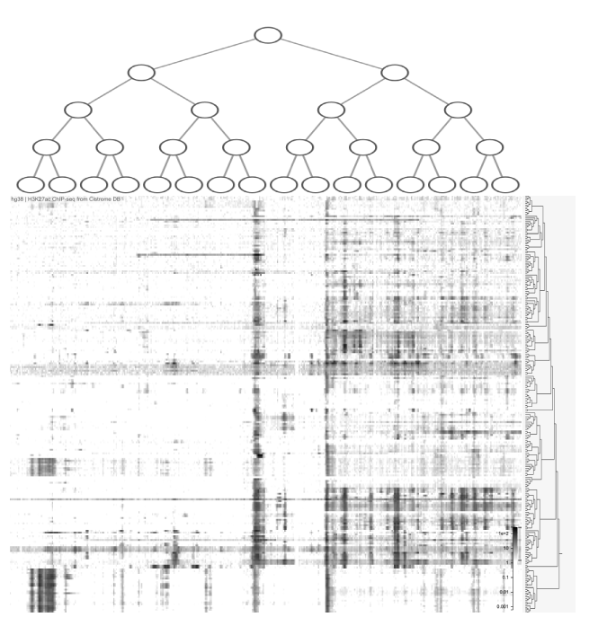
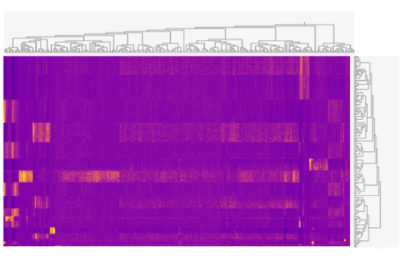

# hierzarrchy

🚧 work in progress / proposal 🚧

### The problem
- Hierarchical clusterings of cells and genes introduce two irregularly shaped trees (one on each axis) in which two nodes at the same level in the tree may have different numbers of leaves.
- Hierarchical clusterings of cells which correspond to genome-wide profiles intoduces one irregularly shaped tree (for the cells axis) and one regularly shaped tree (for the genome axis (HiGlass)).
- Storage of multi-scale data with Zarr has primarily focused on pre-computing image pyramids, which have a regular shape.

#### Notes
- Hierarchical clustering introduces a partial ordering of nodes. For simplicity, this proposal assumes a fixed optimal ordering of nodes.
  - For example, the gene axis of a gene-by-cell matrix may be optimally ordered for visualization using the method proposed by Bar-Joseph et al. 2001.
- When determining the best storage layout to minimize the number of chunks requested, focus on visualization use cases:
  - Typically looking at a single resolution at a time (along each axis), so fine to store different resolutions in different groups
  - Typically panning along a single resolution at a time, so chunks should store values contiguously within each resolution

- Perhaps this problem has already been solved and I just do not know where to find the solution. Perhaps it is related to [space-filling trees](https://en.wikipedia.org/wiki/List_of_data_structures#Space-partitioning_trees)? 

### Goal

- Python CLI for creating a Zarr store which contains multi-scale irregular-by-regular hierarchies
  - Input:
    - Files: BigWig files for individual genomic tracks + JSON dendrogram file whose leaves correspond to each BigWig file
    - Parameter: `starting_resolution` The genomic axis starting resolution. By default, `200` bases.
    - Parameter: `num_cuts` The number of cuts of the dendrogram on the irregular axis, regularly spaced along the height.
  - Output: the multi-scale Zarr store
- Python CLI for creating a Zarr store which contains multi-scale irregular-by-irregular hierarchies
  - Input
    - Files: Cell-by-gene matrix + JSON dendrogram for genes + JSON dendrogram for cells
    - Parameter: `num_cuts_obs` The number of cuts of the dendrogram on the cell irregular axis, regularly spaced along the height.
    - Parameter: `num_cuts_var` The number of cuts of the dendrogram on the gene irregular axis, regularly spaced along the height.
    - The JSON dendrogram for genes should be optional, allowing the user to instead specify a SciPy hierarchical clustering algorithm
    - The JSON dendrogram for cells should be optional, allowing the user to instead provide flat cell type annotations plus a cell type ontology
  - Output: the multi-scale Zarr store

### Eventually
Once the CLI has been created:
- Add support for visualization of the multi-scale irregular-by-regular hierarchies to HiGlass or Cistrome Explorer.
  - Use case: single-cell ATAC-seq profiles for thousands or millions of cells, along the whole genome
- Add support for visualization of the multi-scale irregular-by-irregular hierarchies to the Vitessce heatmap.
  - Use case: single-cell RNA-seq profiles for thousands or millions of cells, and thousands of genes
  
Once a Zarr multi-scale convention has been defined, it would also be useful to create an API which can return multi-scale responses from a single-scale store on-the-fly.

### Resources
- [Zarr multiscale convention](https://github.com/zarr-developers/zarr-specs/issues/50)
- [HiGlass Zarr datafetchers](https://github.com/higlass/higlass-zarr-datafetchers)
- [Bar-Joseph et al. 2001](http://citeseerx.ist.psu.edu/viewdoc/download?doi=10.1.1.83.6798&rep=rep1&type=pdf)
- [Elmqvist et al. 2008](https://ieeexplore.ieee.org/abstract/document/4475479/)

